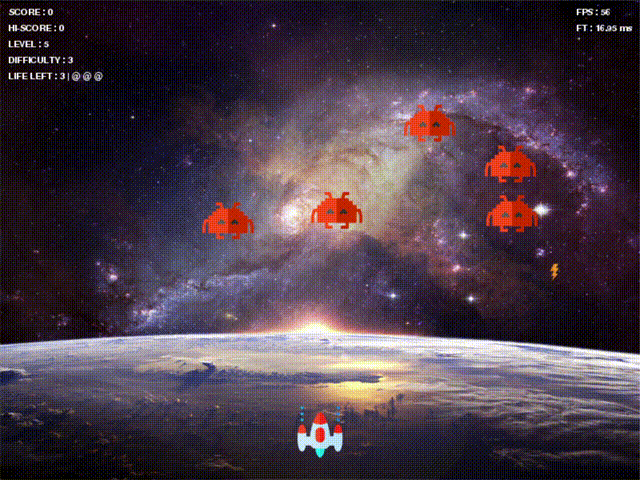
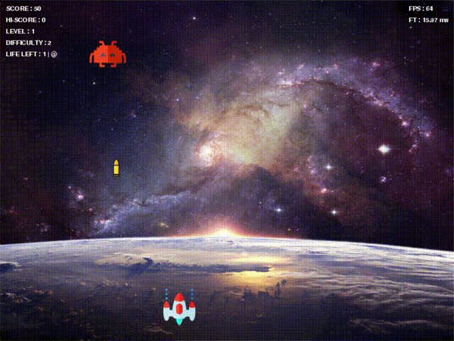
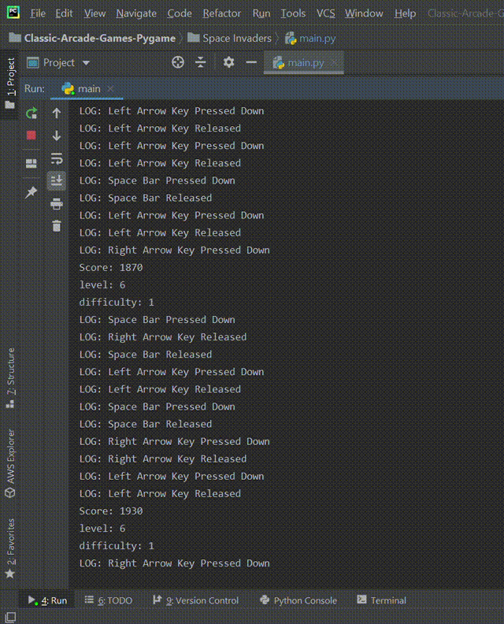

# Classic-Arcade-Games-Pygame
A pygame Implementation of the popular Classic Atari and NES Arcade games

Here are the list of games in this collection:
1. Space Invaders (my version)
2. more coming soon . . .

# 1. Space Invaders
The classic [Space Invaders](https://en.wikipedia.org/wiki/Space_Invaders) was the first blockbuster arcade video game, responsible for starting the [golden age of video arcade games](https://en.wikipedia.org/wiki/Golden_age_of_arcade_video_games). It also sets the template for the [shoot 'em up](https://en.wikipedia.org/wiki/Shoot_%27em_up) genre, and influences nearly every shooter game released since then. 

The classic Space Invaders 1978 was created by [Tomohiro Nishikado](https://en.wikipedia.org/wiki/Tomohiro_Nishikado) and was released by [Taito Corporation](https://en.wikipedia.org/wiki/Taito) in the year 1978.

## Concept
In **my Implementation** of the game, the concept remains the same, i.e the *player spaceship* shoots the *aliens* or *monsters* and in doing so gain *points* followed by *level ups* and *increase in game speed* and *difficulty*.

What differs from the classic implementation and the features are are listed below:
* In each level, the number of *enemies* equals the *level number*, unlike the classic version in which there are 55 enemies each level.
* After a certain number of *kills*, the *difficulty* goes up, resulting in a *speed increase* of the aliens. 
* The *enemy* keeps on respawning and will never die completely.
* The *enemy* may shoot a *laser beam* depending on *random chance* or *probability*.
* The *random chance* or *probability* of the enemy shooting you goes up as level increases.
* The score is incremented on a successful kill and the value is based on the *level number* and *difficulty number*.

## Features
The features of the game is as follows:
* The player can be moved *left* or *right* using the `Left Arrow` and `Right Arrow` keys.
* The game can be **paused** (v1.1.2 onwards) with `Enter key` or `Esc key`.
* The player *levels up* with *increase in number of enemies* and a *level up sound* (v1.1.1 onwards)
* The game has a **background music** (the classic Space Invaders music) which changes and becomes *more intense* with increase in *difficulty*.
* The game pause has the classic sound effect
* Each game object and every Interactions has sound effects.
* The game has **key logging** feature and every input is **logged into the console**
* The game also has **FPS Tracking** and Each **Frame Render time** in miliseconds and displays it in the game.

## Gameplay
Here is a short **gameplay** of the game at `Level 01` `Difficulty 01`:

A demo of in game **pause feature** in action at `Level 05` `Difficulty 03`:

A look at **Game Over** Screen:

**Logging** **KeyStrokes** and **Game states** on the console:

## Installation
#### On windows:
1. ensure that you have **python** and **pip** on your machine
2. clone the repo to a local directory
3. open command prompt (cmd) and enter the following commands:
4. create a virtual environment `py -m pip install --user virtualenv`
5. `py -m venv env`
6. activate the virtual environment `.\env\Scripts\activate`
7. install the game dependencies from the requirements.txt file using the command `pip install -r requirements.txt`
8. navigate to **main.py** and launch the game using the command `cd Space Invaders && python main.py`

you can skip creating a virtual environment if you wish and **ignore steps 4-6** but it is not recommended.

## References and Resources
All the resources used are mentioned below:

#### Images:
* [background.jpg](https://wallpaperscraft.com/download/galaxy_universe_stars_125862/800x600)
* [alien.png](https://www.flaticon.com/free-icon/alien_389125)
* [beam.png](https://www.flaticon.com/free-icon/bolt_414858)
* [bullet.png](https://www.flaticon.com/free-icon/bullet_224681)
* [enemy.png](http://getdrawings.com/space-invaders-icon#space-invaders-icon-70.png)
* [rocket.png](https://www.flaticon.com/free-icon/startup_1067357)
* [spaceship.png](https://www.flaticon.com/free-icon/space-invaders_744737)

#### Music and Sounds:
* [1up.wav](https://www.sounds-resource.com/nes/smb3/sound/768/)
* [annihilation.wav](https://freesound.org/people/Robinhood76/sounds/187646/)
* [enemykill.wav](https://freesound.org/people/SilverIllusionist/sounds/470585/)
* [explosion.wav](https://freesound.org/people/IdkMrGarcia/sounds/446624/)
* [gameover.wav](https://freesound.org/people/MattiaGiovanetti/sounds/483056/)
* [gunshot.wav](https://freesound.org/people/pauliep83/sounds/34251/)
* [laser.wav](https://freesound.org/people/THE_bizniss/sounds/39456/)
* [pause.wav](https://www.sounds-resource.com/nes/smb3/sound/768/)
* [Space_Invaders_Music.ogg](https://en.wikipedia.org/wiki/File:Space_Invaders_Music.ogg)
